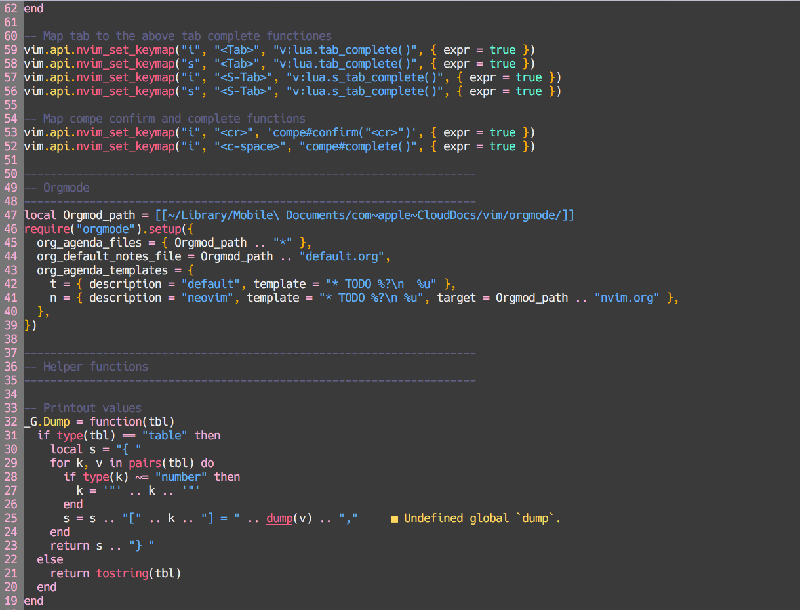

# 梅 💮 mei.nvim
A beautiful color scheme that is written in lua. It works in both vim and neovim.

## Screenshot


## Getting started 🏡

### Requirements
- Neovim 0.5+

## Installation 💾
Use your faviourie package manager to install mei.nvim

#### Packer

```lua
use 'shoukoo/mei.nvim'
```

#### Vim-Plug
```viml
Plug 'shoukoo/mei.nvim'
```

## Setup

### Vimscript
```vim
colorscheme mei
```

### Lua
```lua
require('mei')
```

## Supoorted Plugins
- [TreeSitter](https://github.com/nvim-treesitter/nvim-treesitter)
- [LSP Diagnostics](https://github.com/neovim/nvim-lspconfig)
- [Telescope](https://github.com/nvim-telescope/telescope.nvim)
- [Orgmode](https://github.com/kristijanhusak/orgmode.nvim)
