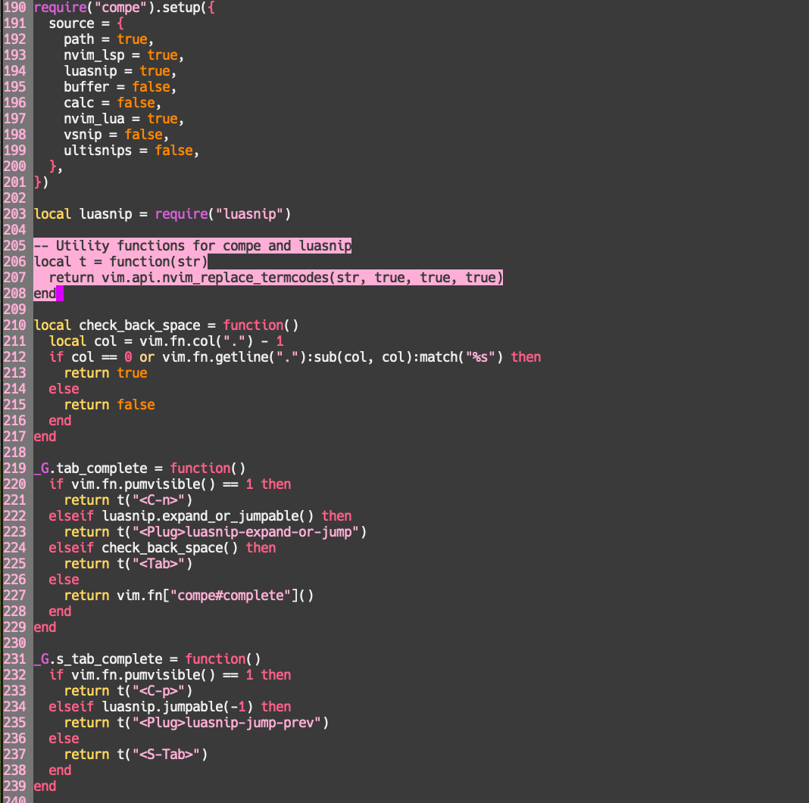

# 💮 mei.nvim
A beautiful colorscheme that is written in lua.

## Screenshot


## Quick Start
* Vim-plug
```vim
Plug "shoukoo/mei.nvim"
```
* Packer
You can add the following in your `init.lua`.
```lua
require("packer").startup(function()
  use({"shoukoo/mei.nvim", branch="first-commit"})
end)
...
require("shoukoo/mei.nvim")
```
